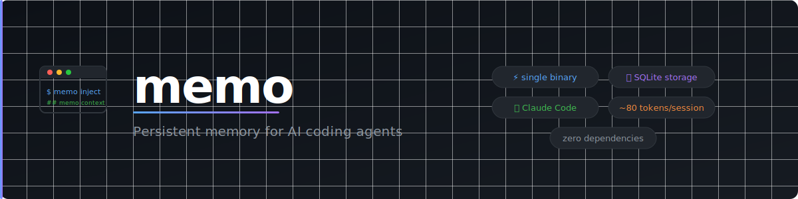

<p align="center">
  
</p>

<h1 align="center">aimemo — Persistent memory for AI coding agents</h1>

<p align="center">
  AI agents forget everything between sessions.<br/>
  aimemo gives them a memory that survives — across sessions, across tools, without any effort on your part.
</p>

<p align="center">
  <a href="https://github.com/rustkit-ai/aimemo/actions/workflows/ci.yml"></a>
  <a href="https://crates.io/crates/aimemo"></a>
  <a href="LICENSE"></a>
</p>

---

**AI coding agents are stateless by design.** Every session, the agent wakes up with no memory of what it did yesterday. It re-reads files it already read, re-discovers conventions it already learned, asks questions it already answered. On any non-trivial codebase, this costs 5–15 minutes of context rebuilding — every single time, every session.

`aimemo` is the memory layer that fixes this. A compact context block (~100 tokens) is automatically captured, maintained, and injected at every session start. **The agent knows where it left off. You just work.**

### What you actually get

**Time back.** 5–15 minutes per session no longer wasted on context rebuilding. Across 3–4 sessions a day, that's up to an hour recovered — every day.

**Flow, uninterrupted.** When you pick up a project after a break, you no longer need to remember where you left off. The agent already knows. You start working immediately.

**Todos that don't disappear.** A "I'll come back to this" told to the agent at the end of a session is gone by the next one — unless you use aimemo. Todos stay open until the agent explicitly closes them. Nothing falls through the cracks.

**An agent that makes fewer mistakes.** An agent that knows what was done recently makes fewer wrong assumptions. It won't propose refactoring something that was just refactored. It won't reopen a decision that was already made.

```
$ aimemo inject

## aimemo context
recap (2026-03-15): "migrated DB to PostgreSQL 16 — next: update connection pool config"
recent (2026-03-15): "modified src/db/pool.rs: extracted pool config"
recent (2026-03-15): "modified src/db/migrate.rs: added pg16 migration"
todo: update connection pool config in production
recent tags: db · migration · auto
```

> **Demo:** *(coming soon — a short recording of Claude picking up exactly where it left off)*

---

## Why aimemo

There are several ways to tackle AI session continuity. Most fall into one of two traps:

- **Capture everything** — hook into every tool call, store every action, build a dense memory. Comprehensive, but noisy: you end up injecting thousands of tokens of raw logs that dilute the signal and slow the agent down. It also requires a local server, a vector database, and a stack of dependencies just to get started.
- **Maintain it manually** — keep a notes file and update it yourself between sessions. Simple, but it means you're doing the work, not the agent.

aimemo takes a third path.

**Automatic where it can be.** On Claude Code, three hooks handle everything: file edits are captured as they happen, context is injected at session start, and the memory block is updated when you close. Zero manual steps, ever.

**Intentional where hooks don't exist.** For Cursor, Windsurf, and Copilot, aimemo writes precise instructions into the agent's rules file — the agent logs what matters, not everything.

**Always compact.** The injected context block stays around 100 tokens. Enough for the agent to know exactly where it left off. Not so much that it crowds out your actual work.

**Zero infrastructure.** One binary. Local SQLite. No server, no API key, no Python, no Node. Works on a fresh machine, in CI, offline, forever.

**Agent-agnostic.** The AI tooling landscape will keep fragmenting. aimemo doesn't bet on one tool — every agent reads from the same local store.

---

## Install

**cargo**:
```sh
cargo install aimemo
```

**curl** (Linux / macOS):
```sh
curl -fsSL https://github.com/rustkit-ai/aimemo/releases/latest/download/install.sh | sh
```

**brew**:
```sh
brew tap rustkit-ai/aimemo https://github.com/rustkit-ai/aimemo
brew install aimemo
```

**First time in a project?** Bootstrap your memory from git history:
```sh
aimemo setup && aimemo bootstrap
```
aimemo will import your recent commits so the agent has context from day one — even before the first AI session.

---

## Claude Code — fully automatic

Claude Code is a CLI tool with a native hook system. `aimemo setup` installs **three hooks** that automate the full memory loop with zero manual steps.

```sh
aimemo setup           # all agents
aimemo setup --claude  # Claude Code only
aimemo setup --cursor  # Cursor only
```

Three things happen:

1. `CLAUDE.md` gets aimemo instructions and an initial context block
2. `.claude/settings.json` gets three hooks:
   - **UserPromptSubmit** — injects fresh context at the start of each session (`--once` guard avoids redundant updates)
   - **PostToolUse** — auto-logs every file edit with a code description (`"wrote src/auth.rs: added fn handle_login"`) and tag `auto`
   - **Stop** — updates `CLAUDE.md` with the latest context when you close a session
3. Claude reads `CLAUDE.md` automatically at startup — it already knows what was done last session

### The Claude Code loop

```
Open Claude Code
      │
      ▼
UserPromptSubmit hook fires → aimemo inject --claude --once
      │
      ▼
Claude reads CLAUDE.md  ←── context from last session
      │
      ▼
You work — Claude edits files
      │
      ▼
PostToolUse hook fires automatically → aimemo capture
      │  (logs "wrote src/auth.rs: added fn handle_login" with tag "auto")
      ▼
You close Claude Code
      │
      ▼
Stop hook fires → aimemo inject --claude
      │
      ▼
CLAUDE.md updated silently — ready for next session
```

### Example

```
You: what did we do last time?

Claude: Based on aimemo — you migrated the DB to PostgreSQL 16.
        Pending: update the connection pool config. Should I start there?
```

No copy-pasting. No manual notes. Claude picks up exactly where it left off.

---

## Cursor, Windsurf, GitHub Copilot — agent-triggered

Cursor, Windsurf, and Copilot are IDE extensions — they don't expose a session lifecycle hook like Claude Code does. Instead, `aimemo setup` writes instructions directly into their rules files, telling the agent to run the inject command itself at the start of each session.

```sh
aimemo setup
```

| Agent | Auto-capture | Rules file | Inject command |
|---|---|---|---|
| **Claude Code** | ✓ via PostToolUse hook | `CLAUDE.md` | `aimemo inject --claude` |
| **Cursor** | via instructions | `.cursor/rules/aimemo.mdc` (`alwaysApply: true`) | `aimemo inject --cursor` |
| **Windsurf** | via instructions | `.windsurfrules` | `aimemo inject --windsurf` |
| **GitHub Copilot** | via instructions | `.github/copilot-instructions.md` | `aimemo inject --copilot` |
| **VS Code** | via instructions | `.github/copilot-instructions.md` | `aimemo inject --vscode` |

### The Cursor / Windsurf / Copilot loop

```
Open agent
      │
      ▼
Agent reads rules file (loaded automatically)
      │
      ▼
Agent runs: aimemo inject --[agent]
      │
      ▼
Rules file updated with latest context
      │
      ▼
Agent knows where it left off — starts working
      │
      ▼
You work — agent logs:
  aimemo log "migrated DB to PostgreSQL 16"
  aimemo log "todo: update connection pool config"
      │
      ▼
Next session — same loop
```

### Example

```
You: [opens Cursor]

Cursor: Based on aimemo — last session you migrated the DB to PostgreSQL 16.
        Pending: update the connection pool config. Should I start there?
```

The difference from Claude Code: the context file is updated **at the start** of the next session rather than at the end of the current one. The result is the same — the agent always knows where it left off.

---

## How it works — automatic capture

### Claude Code (fully automatic)

`aimemo setup` installs three Claude Code hooks in `.claude/settings.json`:

| Hook | Trigger | What it does |
|---|---|---|
| `PostToolUse` | After every Write / Edit / MultiEdit | Runs `aimemo capture` — auto-logs with a code description (`"added fn handle_login"`) and tag `auto` |
| `UserPromptSubmit` | At the start of each session | Runs `aimemo inject --claude --once` — injects context only if new entries exist |
| `Stop` | When you close Claude Code | Runs `aimemo inject --claude` — updates `CLAUDE.md` with the latest context |

This means **every file edit is automatically logged** with zero agent instructions needed. The `CLAUDE.md` context block is always fresh.

### Cursor, Windsurf, Copilot (instruction-driven)

For agents without a hook system, `aimemo setup` writes instructions into the agent's rules file. The instructions tell the agent to:

- Run `aimemo inject --[agent]` at session start
- Run `aimemo log "modified {filename}: {reason}"` after each file modification
- Run `aimemo log "todo: {description}"` when it identifies a future task
- Run `aimemo recap "..."` at session end

The agent follows these instructions as part of its normal workflow.

---

## Agent guides

Full setup and usage details for each agent:

- [Claude Code — fully automatic via hooks](docs/agents/claude-code.md)
- [Cursor — persistent context with alwaysApply rules](docs/agents/cursor.md)
- [Windsurf — session memory via .windsurfrules](docs/agents/windsurf.md)
- [GitHub Copilot — persistent instructions across sessions](docs/agents/copilot.md)

---

## Team

`aimemo sync` reads and writes a `.aimemo/memory.json` file in your project directory. Commit that file and your whole team shares the same agent memory.

```sh
aimemo sync                  # pull new entries from team + push yours
aimemo sync --export-only    # only update the shared file
aimemo sync --import-only    # only pull from the shared file
```

Each developer's local DB stays private. Only what's been synced ends up in `.aimemo/memory.json`.

---

## Commands

### Memory

| Command | Description |
|---|---|
| `aimemo log "<message>"` | Save a memory entry |
| `aimemo log "<message>" --tag refactor` | Save with a tag |
| `aimemo log -` | Read message from stdin |
| `aimemo recap "<summary>"` | Log end-of-session summary (shown prominently at next session start) |
| `aimemo todo list` | List all open todos |
| `aimemo todo done <id>` | Mark a todo as done |
| `aimemo edit <id>` | Edit an entry in `$EDITOR` |
| `aimemo delete <id>` | Delete a specific entry |
| `aimemo prune --older-than 30d` | Delete entries older than a duration |
| `aimemo clear` | Clear all memory for current project |
| `aimemo bootstrap` | Import recent git commits as memory entries |
| `aimemo bootstrap --limit 10` | Limit to last 10 commits |

### Context injection

| Command | Description |
|---|---|
| `aimemo inject` | Print context block to stdout |
| `aimemo inject --claude` | Write context into `CLAUDE.md` |
| `aimemo inject --cursor` | Write context into `.cursor/rules/aimemo.mdc` |
| `aimemo inject --windsurf` | Write context into `.windsurfrules` |
| `aimemo inject --copilot` | Write context into `.github/copilot-instructions.md` |
| `aimemo inject --vscode` | Write context into `.github/copilot-instructions.md` (VS Code) |
| `aimemo inject --all` | Write to all configured agent files at once |
| `aimemo inject --since 7d` | Limit context to entries from the last 7 days |
| `aimemo inject --format json` | JSON output for programmatic use |
| `aimemo inject --once` | Only inject if context has changed (for use in hooks) |

### Browsing

| Command | Description |
|---|---|
| `aimemo list` | Show last 10 entries |
| `aimemo list --all` | Show all entries |
| `aimemo list --tag bug` | Filter by tag |
| `aimemo search <query>` | Full-text search across all entries |
| `aimemo search <query> --since 7d` | Full-text search within a time window |
| `aimemo tags` | List all tags with usage counts |
| `aimemo stats` | Entry count and token savings estimate |

### Backup

| Command | Description |
|---|---|
| `aimemo export` | Export all entries to JSON (stdout) |
| `aimemo export -o backup.json` | Export all entries to a file |
| `aimemo import <file>` | Import entries from a JSON export |

### Team

| Command | Description |
|---|---|
| `aimemo sync` | Sync with `.aimemo/memory.json` (import + export) |
| `aimemo sync --export-only` | Only update the shared file |
| `aimemo sync --import-only` | Only pull from the shared file |

### Project

| Command | Description |
|---|---|
| `aimemo setup` | One-time setup for all agents (or pass `--claude`, `--cursor`, `--windsurf`, `--copilot` to select) |
| `aimemo init` | Initialize project memory |
| `aimemo doctor` | Check hooks, DB, and all agent config files |

### Global options

| Option | Description |
|---|---|
| `--project <dir>` | Use a different project directory (works with any command) |

### Environment variables

| Variable | Description |
|---|---|
| `AIMEMO_DB_DIR` | Override the database directory (default: `~/.local/share/aimemo`) |

---

## The vision

aimemo is not just a CLI tool — it's the foundation of **continuous AI-assisted development**.

Today, AI coding sessions are episodic: each one starts fresh and ends with context thrown away. aimemo makes them continuous: every session is a direct continuation of the last, regardless of which AI tool you're using or how much time has passed.

As agents become more autonomous — running longer tasks, working across multiple tools, eventually operating overnight — the need for a shared, persistent, lightweight memory layer only grows. aimemo is designed to be that layer: simple enough to stay out of your way, robust enough to be the backbone of your entire AI-assisted workflow.

---

## License

MIT — [rustkit-ai/aimemo](https://github.com/rustkit-ai/aimemo)
